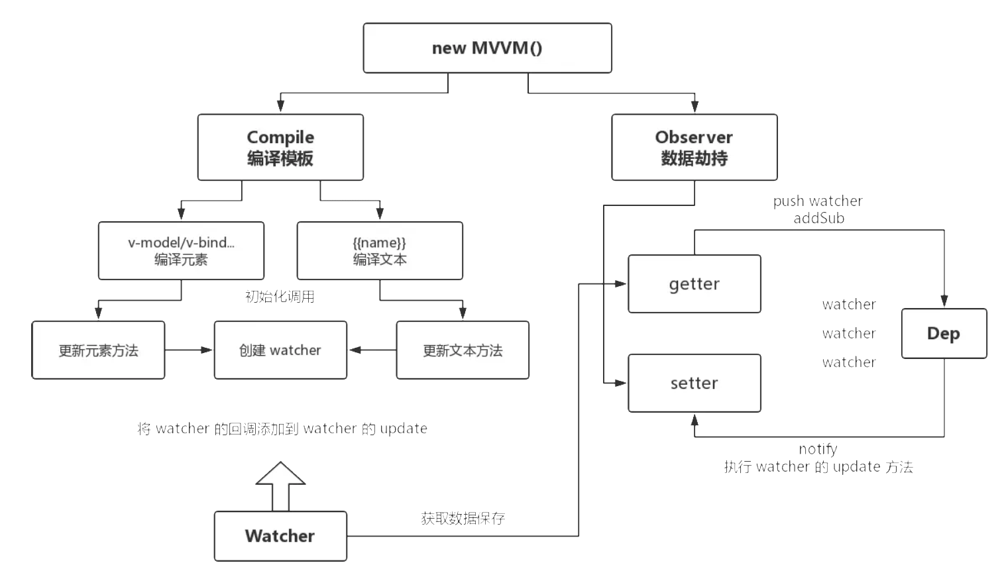

# MVVM 框架
## 观察者模式
- 添加观察者,触发观察者操作(重点)



## 一个简单的观察者模式
```js
// 观察者
class Watcher{
    constructor(cb){
        this.cb=cb;
    }
    update(){
        this.cb();
    }
}
//观察者队列
class Dep{
    constructor(){
        this.subs=[];
    }
    addSub(cb){
        this.subs.push(cb)
    }
    notify(){
        this.subs.forEach(watcher=>{
            watcher.update();
        })
    }
}
//触发
let d=new Dep();
d.addSub(new Watcher(()=>{console.log(1)}));
d.addSub(new Watcher(()=>{console.log(2)}));
d.addSub(new Watcher(()=>{console.log(3)}));
d.notify();
d.notify();

let d2=new Dep();
d2.addSub(new Watcher(()=>{console.log(11)}));
d2.notify();
```